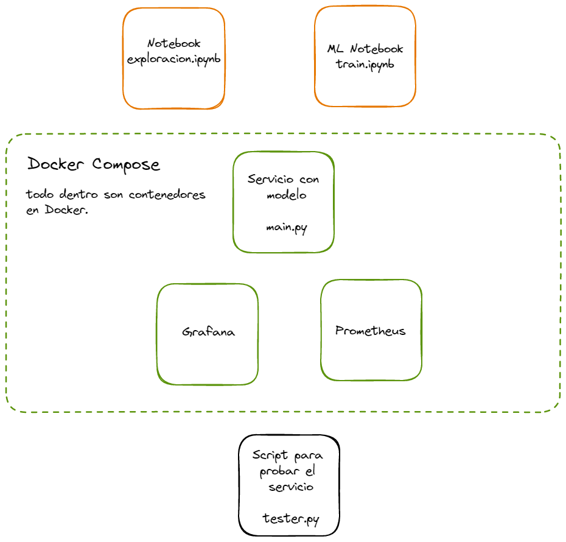

# Anomaly Detection in Telecom - BI Solution

This Project is part of a Master's candidate tesis that proposes to build a Business Intelligence Solution to monitor and identify anomalies in Telecommunication Networks. It is composed of: Data Ingestion, processing and storage, data mining practices, dashboard for monitoring and notification of anomalies.

<https://miro.com/app/board/uXjVPPpgmI8=/?share_link_id=869557065143>

<https://excalidraw.com/>
