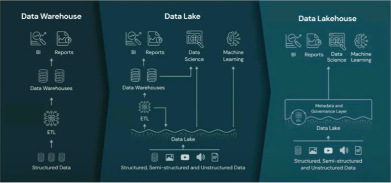

# Anomaly Detection in Telecom - BI Solution

Business Intelligence Solution to monitor and identify anomalies in Telecommunication Networks.

1)  Time Series data extraction and load
2)  Data Transformation and Data Mining Practices
3)  Dashboard for Monitoring
4)  Notificating of Anomalies

<https://miro.com/app/board/uXjVPPpgmI8=/?share_link_id=869557065143>
